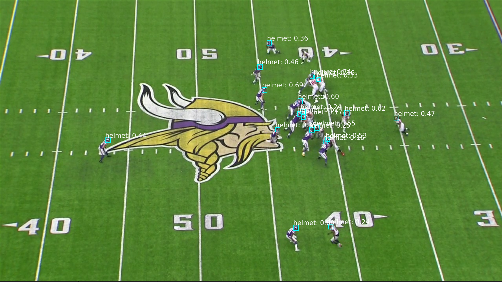

# NFL Object Detection

Using a computer vision model to classify helmet impacts in the NFL could be an important step toward improving player safety. The NFL listed this task as a Kaggle competition in attempt to address this need. 

The data provided by the NFL is available directly at this link: https://www.kaggle.com/c/nfl-impact-detection/data. The dataset included 120 training videos with just under 60 frames per second and a corresponding CSV file with information related to each frame, including manually annotated bounding boxes identifying the location of helmets in each frame. 9,947 images along with a corresponding labeled CSV file were also provided as an ancillary dataset to assist with training. 6 test videos were also provided (without a corresponding CSV file). A train and test CSV file with player tracking information was also provided. Breakdown is below:

- 120 Training Videos, Training CSV file (with labeled bounding boxes of helmets and labeled possible impacts, 14 columns, 983,885 rows)
- 6 Test Videos
- 9947 Training Images, 1280w x 720h, Image Labels CSV file
- Training and Test Player Tracking CSV

Detecting helmet impacts is no easy task. Some of the challenges entailed are the smaller sizes of the bounding boxes, accounting for views from both the endzone and the sideline, accounting for player location, distinguishing helmet impacts from other types of impacts, and other complications. An attempt is made at detecting helmet impacts, but there is much further work that can be done to improve this model which will be explained at the end of the notebook. The provided image files and corresponding image label file were not used for this project. Instead, images were captured from frames of a limited set of the video files as arrays and were compressed to a memory cache and encoded as JPEG files (removes the need to write images to file).

RetinaNet is a single-stage object detector that optimizes both speed and accuracy. The majority of the structure used for this project is available as an open source here: https://keras.io/examples/vision/retinanet/. RetinaNet is built with a backbone network called a Feature Pyramid Network (FPN). This is built on top of ResNet, a prebuilt convolutional neural network. For this project, ResNet50 was used, but ResNet101 or ResNet102 could be used in this same structure (but would increase training time significantly). There are two subnetworks, one responsible for object classification (a classification task) and the other for localization of bounding boxes (a regression task).

### Video Labels:
Below is the provided training labels of each video, broken out by each labeled helmet and the corresponding video frame. As described in the Kaggle competition, the feature descriptions are as follows:

- gameKey: the ID code for the game.
- playID: the ID code for the play.
- view: the camera orientation.
- video: the filename of the associated video.
- frame: the frame number for this play.
- label: the associate player's number.
- [left/width/top/height]: the specification of the bounding box of the prediction.
- impact: an indicator (1 = helmet impact) for bounding boxes associated with helmet impacts
- impactType: a description of the type of helmet impact: helmet, shoulder, body, ground, etc.
- confidence: 1 = Possible, 2 = Definitive, 3 = Definitive and Obvious
- visibility: 0 = Not Visible from View, 1 = Minimum, 2 = Visible, 3 = Clearly Visible

## Preprocessing data
On a high level, detecting objects in an image involves two central tasks, localization and classification, i.e. identifying where objects are located in the image as well as identifying which objects they are (and how many). The majority of the original structure of the model I used is available at https://keras.io/examples/vision/retinanet/.
Significant preprocessing was required to create an efficient input data pipeline for the RetinaNet model (without using PyTorch). In retrospect, some of the steps I took may have been unnecessary, but it was part of the learning process of what type of structure was required. Most of the preprocessing took place in the preprocessing notebook.

### Capturing Frames from Videos:
Using OpenCV throughout this project, I captured each video frame in the unique dataframe as an array to be later encoded as JPEGs for training. If any of the arrays are not successfully captured, they are appended to a "missing_list" and removed from the dataset.

### Preview Bounding Boxes
Below we can preview the bounding box annotations on a particular image (using cv2.rectangle).

### Write to JSON
Writing annotations to JSON files similar to the COCO (Common Objects in Context) dataset format. These files do not match the COCO format exactly, but some features were kept just to mimic most of the COCO structure (i.e. license, coco_url, date_captured, and flickr_url were not used. Although not necessary, zero was imputed for "is_crowd"). More information on COCO is available here: https://cocodataset.org/#detection-2020. A breakdown of all files is below:

Images: Image filenames and details of the image (height, width, id)

Categories: One category: helmet

Objects: Bounding box annotations

Annotations: Combining all above JSON files as nested dictionaries

### Using the pycocotools API for Annotations
The pycocotools API is used to assist in parsing, loading, and visualizing annotations in the COCO format.

### Converting to TensorFlow Records
Referencing this public Kaggle notebook, https://www.kaggle.com/karthikeyanvijayan/coco-object-detection-dataset-in-tfrecord, I created a directory for train and test tensorflow records, specified the record path, and then converted files to TFRecords in order to properly utilize the keras implementation of RetinaNet for object detection.

Converting data to TFRecords has multiple advantages, the main being that TFRecords are TensorFlow’s binary file storage format, which can be read extremely efficiently from disk, and can be distributed to multiple TPUs (Tensor Processing Units) when training, which significantly reduces training time.

## Creating an Input Pipeline
The TFRecords created in the preprocessing stage were uploaded to Google Cloud and the model was created in Google Colab, importing files directly from Google Cloud.

### Computing IOU (Intersection Over Union):
Intersection over union is the calculation of the overlap of anchor boxes (which will be implemented later) to ground truth boxes (our original annotations). It is calculated as the area where an anchor box intersects with the ground truth box, divided by the combined total area of the anchor box and ground truth box minus the intersecting area.

### Visualizing Detections:
The visualize_detections function was modified from the original open source to include a combination of bounding boxes that intersect within a specified IoU range. The bounding boxes that intersect within that range are labeled as impacts. This was an attempt at predicting impacts with 2D data alone and will not prove to be overly accurate since we are not accounting for player location, just the location of helmets in the image of a single view.

### Create Anchor Boxes
A description of anchor boxes is available in the open source project and is quoted below:

"Anchor boxes are fixed sized boxes that the model uses to predict the bounding box for an object. It does this by regressing the offset between the location of the object's center and the center of an anchor box, and then uses the width and height of the anchor box to predict a relative scale of the object. In the case of RetinaNet, each location on a given feature map has nine anchor boxes (at three scales and three ratios)."

I used stats for both width and height of our ground truth boxes and distribution plots to get an idea of how to implement specialized anchor boxes for this particular dataset.

Plotting Width / Height helps determine that the majority of bounding boxes are relatively square, so keeping the aspect ratios at 0.5, 1.0, and 1.5 would cover most of the ratios appropriately.

Plotting the width x height gives us a general idea of the areas of the bounding boxes. Scales were left the same as the open source project (2^x for x in 0, 1/3, 2/3). The original areas were set to x^2 for x in [32, 64, 128, 256, 512]. Since the helmets in most cases are very small objects, the areas were divided in half and set to x^2 for x in [16, 32, 64, 128, 256].

### Preprocess Data Function
Random_flip_horizontal is a data augmentation technique, randomly flipping images and bounding box annotations.

Since all images are of the same size, the resize_and_pad_image values were changed to match the width of 1280 and height of 720, so the final ratio that is returned is 1.0. If images were of different sizes, this would ensure that all images are resized and padded to similar sizes for model training. Stride was left at 128.0.

The preprocess_data function is used to combine both previous functions along with our utility functions for an efficient input pipeline.

### ResNet
ResNet, a prebuilt CNN, is used as the backbone for the bottom-up pathway of our Feature Pyramid Network that will be created. Feature maps are returned at strides 8, 16, and 32. 

The open source did not include freezing the backbone, but this is helpful with significantly reducing training time.

### Feature Pyramid Network
With RetinaNet, a Feature Pyramid Network (FPN) creates a subnetwork for classification (predicting class labels) and a subnetwork for regression (localization, size and shape of bounding boxes) using the backbone's output. Some details regarding the FPN:

Bottom-up pathway: last feature map of each group of consecutive layers (c3, c4, c5) are extracted from ResNet50, a prebuilt convolutional neural network
Top-down pathway: using nearest neighbor sampling, the last feature map from the bottom-up pathway is expanded to the same scale as the second-to-last feature map. The two feature maps are then merged by element-wise addition to form a new feature map until each feature map from the bottom-up pathway has a corresponding feature map connected with lateral connections.
There are 5 levels in the pyramid (P3 through P7), and each level generates predictions using the classification and regression subnetwork
The output for classification is the probability distribution object classes
The output for regression is the offset of anchor boxes and ground truth boxes (4 values for each object: offset of center points and offset of width and height)
Higher level feature maps are proficient at detecting larger objects, covering larger areas of an image, while lower level feature maps are more proficient at detecting smaller objects.

### Classification and Regression Heads

Two separate heads are built for classification and regression, which are shared between all feature maps of the feature pyramid.

### Non-Max Suppression
The NMS operation discards predictions under the confidence threshold and selects the prediction with highest confidence score. Other predictions above the confidence threshold are compared to the highest confidence score using intersection over union. If the IoU is above the set NMS IoU Threshold, then that prediction is also discarded.

The problem with this method is that there are multiple overlapping ground truth bounding boxes in the dataset, so selecting an NMS IoU Threshold may eliminate overlapping anchor boxes that actually match ground truth boxes, thus eliminating true positives. Rather than returning the NMS results after decoding predictions, this was altered to return all results (RetinaNet limits results to 1k for each prediction). While this returns more predictions than desired in the end, ultimately, a higher confidence threshold will be used after training the model to filter out unwanted results. The original NMS code has been commented out so the difference is clear.

### Loss Function

This is a duel-task loss function that includes a term for localization and a term for classification.

Smooth L1 Loss: A smooth l1 loss is used for the regression/localization task of matching ground truth boxes to anchor boxes. The regression subnet predicts 4 numbers, the first two numbers being the offset of the centers of ground truth and anchor boxes and the second two numbers being the offset of width and height.

Focal Loss: similar to a categorical cross entropy loss function, the focal loss function implements two additional parameters of alpha and gamma, which help address one of the main difficulties in object detection, class imbalance. Especially with small object detection, there is a significant imbalance between the background class and the objects being detected. The gamma parameter is a focusing parameter used to down-weight the loss of easily-classified objects and forces the network to focus on harder detections. Inversely, alpha is used to down-weight the loss of examples in the background class.

Both the alpha and gamma parameters were left as the original open source project with alpha = 0.25 and gamma = 2.0. The num_classes parameter was changed to 1 since we are only detecting helmets.

## Model Training

Using TPUs (Tensor Processing Units) is necessary to avoid extremely long training times. This model was run in Google Colab, so here is the list of steps to ensure the input pipeline was efficient:
* Set the Hardware Accelerator to TPU (Runtime>Change Runtime Type)
* Initialize the TPU System
* Set the distribution strategy
* Establish model training parameters. Important note: a batch size that is divisible by 8 takes advantage of distributing training amongst 8 TPU cores. The model directory is set to my Google Cloud bucket path since that is where I am storing data.
* Compiling the model. Compiling the model must be included within strategy.scope() to take advantage of training across multiple TPUs.
* Setting up the input pipeline involves the following steps as mentioned in the original open source project:
1. Apply the preprocessing function to the samples
2. Create batches with fixed batch size. Since images in the batch can have different dimensions, and can also have different number of objects, we use padded_batch to the add the necessary padding to create rectangular tensors
3. Autotune will automatically determine the appropriate level of parallelism and dynamically tune the value at runtime (preprocessing and encoding labels is a costly operation, so utilizing all cores in parallel is much more efficient)
4. Create targets for each sample in the batch using LabelEncoder

I used 25 epochs and established train_steps and test_steps per epoch by dividing the total number of samples in each by the batch size of 8, then using the repeat() function to ensure the model doesn’t run out of data.

Model structure as produced by a TensorBoard Graph:

### Soft Non-Max Suppression

Since I replaced Non-Max Suppression earlier with predicting all possible results, I needed an alternate method to filter undesired results. Using TensorFlow’s tf.image.non_max_suppression_with_scores function, I was able to implement Soft-NMS, which works very similarly to the normal NMS function. Rather than eliminating predictions over a certain IoU threshold, Soft-NMS uses a sigma value (float between 0 and 1) to down-weight the confidence score of detections over the IoU threshold. Using an IoU threshold of 1.0 allowed me to keep all confidence scores as is and select the predictions for each object based on the confidence threshold alone. Ultimately, this eliminates any predictions under the specified confidence score and keeps potential true positives where bounding boxes are intersecting.

### Evaluating Results

Since it’s difficult to evaluate results based on the loss function alone, I built a Pandas DataFrame including the model predictions and then built a residual DataFrame, labeling true positives (any detections above the confidence threshold), false positives (any detections above the confidence threshold but not in the original labeled data), and false negatives (comparing the counts of detections in the original labeled data to the predicted counts).

I compared the results of several confidence thresholds ranging from 0.15 to 0.90, allowing me to check which confidence threshold had the highest Precision, Recall, and F1 Score. I decided to use the highest F1 Score (the harmonic balance between precision and recall) as my determining evaluation metric, since that was also recommended in the Kaggle competition. With a confidence threshold of 0.22, the highest F1 Score was 0.949 for detecting helmets.

Although a little convoluted due to the amount of overall objects, you can get an idea of how the model performed on helmet detection using a scatterplot:

Here is a visualization of an image with confidence scores:

### Detecting Impacts
I set a strict filter for impacts using IoU between bounding box predictions for each image, knowing that helmets with impacts were extremely less likely than helmets without impacts. Any IoU between 0.1 and 0.4 was labeled as an impact. Since I was only dealing with 2D data and didn’t attempt to convert to 3D, this wasn’t overly accurate as mentioned before. There were several helmets without impact that had an IoU between .1 and .4 as shown below. The F1 Score was extremely low for impact detections.

### Predicting Unseen Test Videos

I used the model weights to predict helmet and impact detections on unseen test videos for matching end zone and sideline views. In order to leave open the possibility of evaluating results on these unseen test videos, I set aside 2 videos that were included in the original training set with labels (they were not included when training the model) rather than using the provided test videos without labels. For both views, I used the IoU filter for impacts of 0.1 to 0.4 based on previous EDA.
Here is the scatterplot of helmet detections:

The scatterplot for impact detections:

# Final Video

I created a side-by-side video of the end zone and sideline views showing the predicted helmet and impact detections.

https://www.youtube.com/watch?v=8h1MnvDFl5Q

# Conclusion: 

Although the model did reasonably well with detecting helmets with an F1 Score of .957 for the end zone view and .96 for the sideline view, it is obvious that further work is necessary to improve the detection of helmet impacts. If you fork this notebook, note that the links for writing files to Google Cloud will need to be changed since you will only have reader access. If you want to download the entire dataset, it is best to download directly from Kaggle. Further work can include but is not limited to the following:

* Combining previous data with player tracking data and potentially using homography to locate players in videos based on tracking key points.
* Potentially using 3D Convolutional Neural Network models to identify impacts (computationally expensive).
* Using a Temporal Shift Module (the winner of the Kaggle competition used TSM). Videos have an additional dimension over images, the temporal dimension, which is the shift of objects in images between frames. Using this information, the TSM predicts actions based on a specified range of frames. This is a less computationally-expensive model as it only utilizes 2D CNNs. (With ResNet, this could be added after each convolutional block).

# References:

https://www.nfl.com/playerhealthandsafety/health-and-wellness/injury-data/injury-data

https://keras.io/examples/vision/retinanet/

https://blog.zenggyu.com/en/post/2018-12-05/retinanet-explained-and-demystified/#fn10

